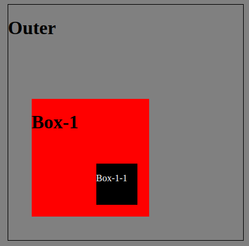
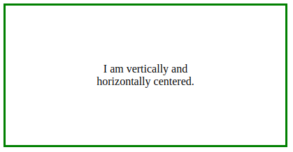

import CodeBlock from "@theme/CodeBlock";
import Tabs from "@theme/Tabs";
import TabItem from "@theme/TabItem";
import Position from "@site/src/components/cssExamples/Position"

# CSS

## Include Stylesheet in HTML

```html
<head>
  <meta charset="UTF-8" />
  <meta name="viewport" content="width=device-width, initial-scale=1.0" />
  <!-- set the path to css file-->
  // highlight-next-line
  <link rel="stylesheet" href="path/to/file.css" />
  <title>Document</title>
</head>
```

## Reset all values

```css
* {
  /* The width and height of the element include the content, padding, and border. */
  box-sizing: border-box;
}

body {
  margin: 0;
  padding: 0;
}
```

## Grid Display

```css
.container {
  display: grid;
  grid-template-columns: 1fr 1fr 1fr; /* Set 3 grid rows*/
}
```

import GridDisplay from '@site/src/components/GridDisplay'

<GridDisplay />

### Grid Placement

```css
.one {
  grid-column: span 2; /* takes x columns */
  grid-row: span 1; /* takes x rows*/
}

.two {
  grid-column: span 1; /* takes x columns */
  grid-row: span 2; /* takes x rows*/
}
```

import GridPlacement from '@site/src/components/GridPlacement'

<GridPlacement />

## Positioning

| Position Value | Description                                                                                                                                                       |
| -------------- | ----------------------------------------------------------------------------------------------------------------------------------------------------------------- |
| `static`       | **Default**: Elements are positioned in the normal flow of the document. They are not affected by the `top`, `bottom`, `left`, or `right` properties.             |
| `relative`     | Elements are positioned relative to their normal position in the document flow. You can use `top`, `bottom`, `left`, or `right` properties to offset the element. |
| `absolute`     | Elements are removed from the normal document flow and positioned relative to the nearest positioned ancestor (or the initial containing block if none).          |
| `fixed`        | Elements are positioned relative to the viewport (the browser window). They do not move when the page is scrolled.                                                |
| `sticky`       | Elements are positioned based on the user's scroll position. They behave like `relative` until they reach a specified offset, then they become `fixed`.           |

```mdx-code-block
<Tabs>
<TabItem value="Relative">
```

Elements are positioned relative to their normal position in the document flow. You can use `top`, `bottom`, `left`, or `right` properties to offset the element.

```css
position: relative;
top: 30%;
left: 60%;
```

<Position position={"relative"} top={"30%"} left={"60%"}/>

```mdx-code-block
</TabItem>
<TabItem value="Absolute">
```

Elements are removed from the normal document flow and positioned relative to the nearest positioned ancestor (or the initial containing block if none).

```css
position: absolute;
top: 30%;
left: 30%;
```

<Position position={"absolute"} top={"30%"} left={"30%"}/>

```mdx-code-block
</TabItem>
<TabItem value="Sticky">
```

Elements are positioned based on the user's scroll position. They behave like relative until they reach a specified offset, then they become fixed.

```css
position: sticky;
top: 20px; /* space between element and parent*/
```

<Position position={"sticky"} top={"20%"} />

```mdx-code-block
</TabItem>
</Tabs>
```

### Absolute-Realtive

```css
.outer {
  position: relative;
}

.box-1 {
  position: absolute;
  bottom: 10%;
  left: 10%;
}

.box-1-1 {
  position: absolute;
  right: 10%;
  bottom: 10%;
}
```



## Overflow

```css
div {
  overflow: auto;
}
```

<div style={{width: "200px", height: "100px", overflow: "auto", backgroundColor: "orange", color: "black", padding: "0.5em"}}>
  You can use the overflow property when you want to have better control of the layout. The overflow property specifies
  what happens if content overflows an element's box.
</div>

## Layout

### Center Page

```css
body {
  display: flex;
  justify-content: center;
  align-items: center;
  min-height: 100vh;
}
```

### Center Item in div

```css
.item {
  margin: auto;
}
```

### Center horizontal and vertical

```css
.container {
  text-align: center;
  height: 200px;
  width: 400px;
  position: relative;
  border: 3px solid green;
}

.center {
  margin: 0;
  position: absolute;
  top: 50%;
  left: 50%;
  -ms-transform: translate(-50%, -50%);
  transform: translate(-50%, -50%);
}
```

```html
<div class="container">
  <div class="center">
    <p>I am vertically and horizontally centered.</p>
  </div>
</div>
```



## Background

```css
background-image: url("./images/background-img.jpg");
background-repeat: no-repeat;

background-size: 100% 50%; /* Set width and height */
background-size: cover; /* auto scale to never have white space */

background-position: 0% 10%; /* left edge, amount to crop at top*/
background-position: center; /* Crop same amount top and bottom */

background-image: linear-gradient(145deg, red 20%, blue 60%, green); /* direction , color (when to transition)*/
/*               shape (circle/ ellipse) size   left, top     start transition */
background-image: radial-gradient(circle 50em at 10% 80%, red 20%, blue);

/* Stack background - first option, second option fallback*/
background: linear-gradient(), url(), #ff1b68;

/* Add filer */
filter: blur(5px);
filter: brightness(0.4);
filter: contrast(200%);
filter: drop-shadow(16px 16px 20px blue);
filter: grayscale(50%);
filter: hue-rotate(90deg);
filter: invert(75%);
filter: opacity(25%);
filter: saturate(30%);
filter: sepia(60%);
```

## Sizing

| Unit / Size | Description                                                                                      |
| ----------- | ------------------------------------------------------------------------------------------------ |
| `px`        | Fixed unit of measurement. Provides precise control but doesn't adapt well to different screens. |
| `%`         | Relative to the parent element's size. Useful for responsive layouts.                            |
| `em`        | Relative to the font size of the element itself. Good for text-related sizing.                   |
| `rem`       | Relative to the root (HTML) font size. More predictable than `em`.                               |
| `vw`        | Relative to the viewport's width, useful for responsive designs.                                 |
| `vh`        | Relative to the viewport's height, often used for responsive layouts.                            |

## Font Awesome

Adding Font Awesome

```html
<link
  rel="stylesheet"
  href="https://use.fontawesome.com/releases/v5.15.4/css/all.css"
  integrity="sha384-DyZ88mC6Up2uqS4h/KRgHuoeGwBcD4Ng9SiP4dIRy0EXTlnuz47vAwmeGwVChigm"
  crossorigin="anonymous"
/>
```
